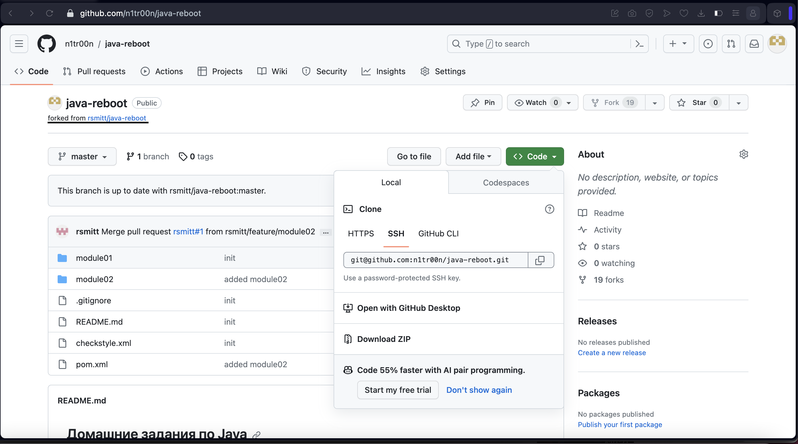

## Домашние задания по Java
Поток 6, 2023.

## Процесс работы над задачами состоит из следующих шагов:
1. Необходимо создать свою копию проекта (форк) в рамках которого будут выполняться задания. Необходимо нажать на кнопку Fork

2. На следующем этапе оставляем настройки по умолчанию
  
3. Приглашаем педагога в проект, переходим в Settings форкнутого проекта -> Collaborators -> Add people. Ищем по почте или по имени rsmitt.
  
4. Клонируем на компьютер форкнутый проект
  
5. В IntelliJ Idea переходим в меню Git -> Pull, выбираем ветку master. Pull подтянет изменения с удаленного репозитория в локальную версию проекта. Для решения задания необходимо создать новую ветку в рамках которой будет выполняться работа. Называем на пример feature/module02 
6. После завершения работы, делаем commit, потом push на удаленный репозиторий 
7. Переходим во вкладку Pull request -> new pull request. Выбираем правильные ветки для merge. В качестве base repository выбрать master ветку вашего проекта
  
8. Добавляем педагога в reviewers
  
9. После получения approve можно выполнять merge в master ветку
  
